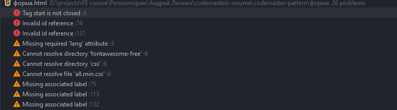
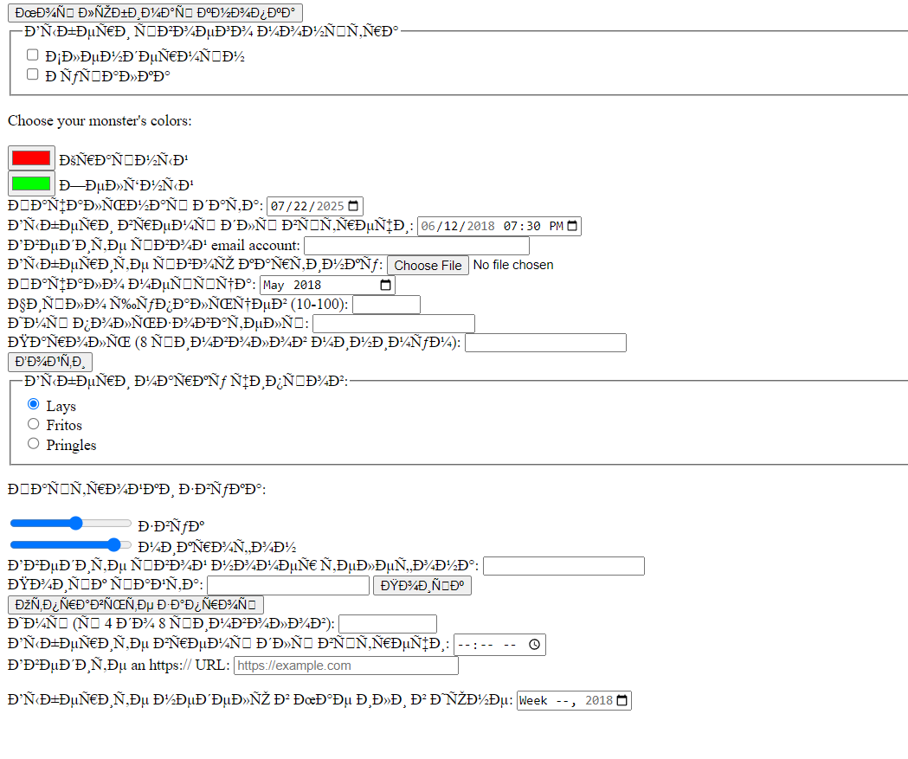

1. Структура проекта немного некорректная. Нужно вынести первое дз если не в отдельный репозиторий, то в отдельную
   директорию рядом с резюме, а не внутри его.
2. Использовать в названии файлов кириллицу недопустимо. Вместо этого всегда используется латиница. Более того, почти
   всегда название основного html файла - index.html (Если коротко то это связано с тем, что сервер по-умолчанию ищет файл index.html )
3. Судя по всему, работа писалась не в IDE. Поскольку, в моем случае, IDE подсветила мне несколько ошибок в коде
4. Кодировка полетела, стоит погуглить и пофиксить. 
